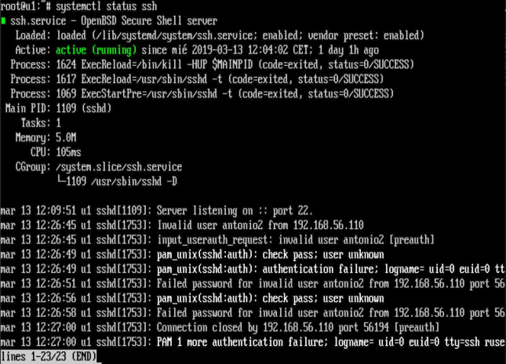

# Practica 1: Preparación de las herramientas
------

## Objetivos de la práctica:
1. Instalación y configuración de ubuntu server en dos máquinas virtuales en VirtualBox
2. Configuración de OpenSSH server y Lamp en ubuntu server
3. Configuración network de las máquinas virtuales
4. Conseguir conectividad entre ambas máquinas con SSH y Curl
------

## Instalacion de Ubuntu server en Virtual Box

Vamos a obviar la instalación de Virtual Box en nuestra máquina y partir desde un punto en el cual asumimos que el lector ya la tiene instalada. El instalable de este software se puede encontrar [aqui](https://www.virtualbox.org/) junto con la documentación oficial.

Para la realización de esta práctica se ha usado *ubuntu server 16*, esta versión puede ser descargada desde [la web oficial de ubuntu](https://www.ubuntu.com/download/server).

Una vez tengamos en nuestra máquina la distribución que hayamos elegidos los primeros pasos no son complicados, por lo que vamos a pasar bastante rápido por estos puntos. Lo primero sera pinchar en el botón "nueva" y elegir un nombre para nuestra distribución, VirtualBox identificará la versión sin problemas. A continuación eligiremos el tamaño del disco virtual y la configuración básica, para la práctica se ha elegido todas las opciones por defecto. Acto seguido deberemos decirle a VirtualBox donde esta nuestro controlador, para ello cambiaremos el disco de control y seleccionaremos nuestro .iso que previamente nos hemos descargado.
El siguiente paso será arrancar la máquina, en cierto punto de la instalación nos saldrá una pantalla en la que podremos elegir el software que deseamos instalar junto a nuestro ubuntu.

Marcamos OpenSSHserver y Lamp y de este modo nuestra máquina ya vendrá instalada con ambos servicios. No obstante si por alguna razon obviamos este paso no hay problema pues podemos acceder a esta pantalla en cualquier momento con la orden

    sudo tasksel

De este modo ya tendremos totalmente operativos tanto los servicios Lamp como ssh sin necesidad de hacerlos manualmente uno a uno.
Llegados a este punto y ante la necesidad de tener dos máquinas para ser interconectadas, se puede optar por clonar la imagen de la primera máquina o realizar todos los pasos de nuevo para obtener la segunda.

## Configuración network de las máquinas virtuales

Lo primero que debemos realizar es añadir un adaptador de red a nuestras máquinas virtuales. Para ello nos dirigimos a configuracion y en el apartado red activamos un segundo adaptador y lo definimos como *host only*.
Una vez añadido deberemos configurar la interfaz de red, la mayor parte de la configuración de la red se puede hacer desde el archivo de configuración interfaces en */etc/network/interfaces*. Aquí, usted puede dar a su tarjeta de red una dirección IP (o usar dhcp), establecer la información de enrutamiento, configurar el enmascaramiento IP, poner las rutas por defecto y mucho más. Para configurarlo basta abrirlo con el editor deseado.

    sudo vi /etc/network/interfaces

Debemos establecer nuetra nueva interfaz como estática y especificarle la IP y la máscara. También se le puede añadir la red y la direccion broadcast.

Tras cambiar dicho archivo debemos reiniciar el servicio, para ellos podemos ejecutar.

    systemctl restart networking

O simplemente reiniciar la máquina.   

En nuestra segunda máquina deberemos realizar el mismo proceso, pero obviamente indicandole otra Ip diferente que este dentro de la misma red. En mi caso a la primera máquina se le ha asignado la direccion 192.168.56.105 y a la segunda 192.168.56.110.

## Conseguir conectividad entre ambas máquinas con SSH y Curl
### SSH
La configuración del servicio ssh se puede hacer desde el archivo */etc/ssh/sshd_config* ,aqui se pueden modificar opciones tales como el puerto de escucha del servicio, prohibir acceso a ciertos usuarios etc. No obstante y por la claridad de la práctica se van a dejar las opciones por defecto. 
Para comprobar que tenemos nuestro servicio en funcionamiento ejecutamos:

    sudo systemctl status ssh

Si todo está correcto debería apareceros como se muestra en la imagen:

Para acceder de una máquina a otra usaremos el comando:

    ssh 192.168.56.105 -l antonio
 
Donde obviamente la direccion Ip introducida es la de la máquina a la que queremos acceder y con el parametro -l indicamos el usuario.

Podemos observar en la imagen como tras la conexion el nombre de la máquina ha cambiado de *antonio2* a *antonio*, lo que nos indica que ya estamos conectados via ssh a nuestra otra máquina.

### Curl

La instalación de este servicio es muy sencilla, basta con escribir los siguientes comandos.

~~~
sudo apt-get update
sudo apt-get install curl
~~~

Para comprobar que el servicio funciona perfectamente podemos crear un archivo html simple en */var/www/html* e intentar abrirlo desde la otra máquina. Para ello usamos el comando

    curl http://192.168.56.105/hola.html

