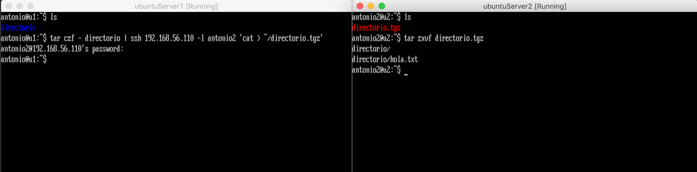
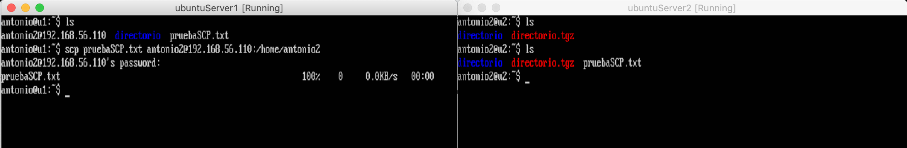
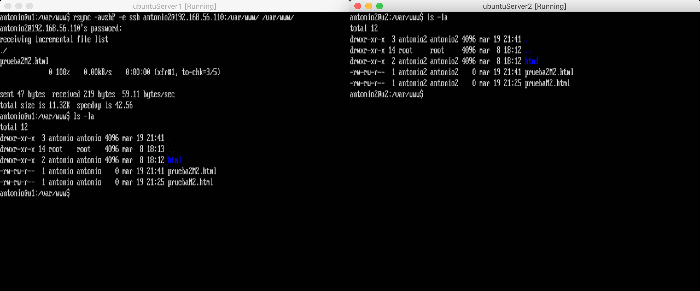
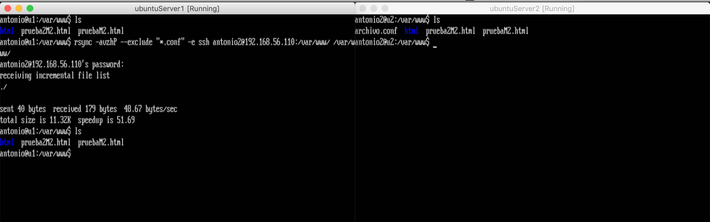
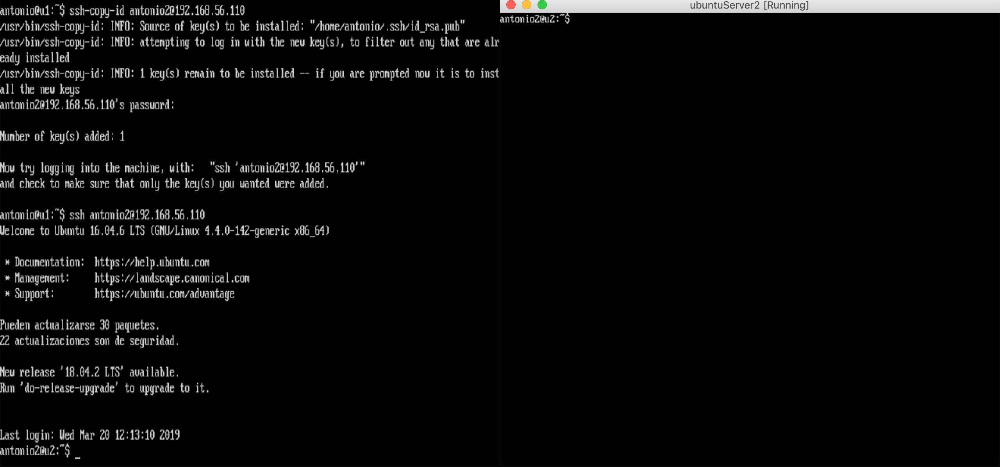

# Práctica 2. Clonar la información de un sitio web
------

## Objetivos de la práctica:
Los objetivos concretos de esta segunda práctica son:

1. Aprender a copiar archivos mediante ssh
2. Clonar contenido entre máquinas
3. Configurar el ssh para acceder a máquinas remotas sin contraseña 
4. Establecer tareas en cron
------
## SSH 
Antes de meternos de lleno en ssh conviene definir que es exactamente SSH, aunque seguramente esta información a estas alturas pueda ser redundante, nunca esta de más. 
SSH es el nombre de un protocolo cuya principal función es el acceso remoto a otras máquinas (servidores) por medio de un canal seguro en el que toda la información está cifrada. Además, SSH permite copiar datos de forma segura (tanto archivos sueltos como simular sesiones FTP cifradas), gestionar claves RSA para no escribir contraseñas al conectar a los dispositivos y pasar los datos de cualquier otra aplicación por un canal seguro tunelizado mediante SSH y también puede redirigir el tráfico para poder ejecutar programas gráficos remotamente. 
#### Copiar archivos mediante SSH.
Entre las opciones que ofrece SSH, en este apartado vamos a centrarnos en como transferir archivos de una máquina a otra. 
Existen varias formas y comandos para enviar archivos de una máquina a otra, scp es una alternativa que hace una función bastante similar. 
En el caso que necesitemos crear un tar.gz de un equipo y dejarlo en otro pero no disponemos de espacio en disco local, podemos usar ssh para crearlo directamente directamente en el equipo destino, esta es la gran diferencia con SCP (secure copy protocol).
El comando a ejecutar para poder crear directamente un archivo en una máquina remota sería el siguiente:

    tar czf - directorio | ssh equipodestino 'cat > ~/tar.tgz'

Básicamente le estamos diciendo al comando tar que use stdout como destino y mandamos con un pipe la salida ssh. Éste coge la sálida del tar y la escribe como fichero en nuestra máquina remota. Tal como vemos en la siguiente imagen, se ha creado un directorio en la máquina *antonio* con un un archivo de texto plano, este se envía a la máquina *antonio2* usando el comando visto anteriormente, tras introducir la contraseña se actualiza la segunda máquina, descomprimimos y ya disponemos de nuestro archivo.

#### Comando SCP

El comando SCP hace uso de SSH para hacer copias seguras y encriptadas. Este comando esta presente tanto en Linux, Mac y Windows mediante WinSCP.
Se puede utilizar scp para copiar archivos de un ordenador local a otro remoto, también se puede copiar del remoto al local y también se puede copiar entre dos remotos, mientras estas conectado a un tercer ordenador, y el tráfico no pasará por el ordenador en que estás.
A continuación se muestra un ejemplo básico del uso de este comando.

Si el lector esta interesado en un conocimiento más profundo de este comando puede encontrar mas informacion,[aqui](https://geekytheory.com/copiar-archivos-a-traves-de-ssh-con-scp) y [aqui](https://www.garron.me/es/articulos/scp.html).

#### Inconvenientes

Aunque SSH es un protocolo muy seguro para la transferencia de información, el gran inconveniente que nos encontramos a la hora de usarlo es mantenimiento de servidores es que estos comandos copian toda la información aunque no haya habido cambios en estos. Esto para pequeños archivos y bases de datos pequeñas puede no ser un problema, pero a la hora de escalarlo y tratas con grandes bases de datos o archivos de un peso considerable acarrearía un problema de demora. Es por ello que en estas circunstancias se usan otras herramientas de transferencia de datos de forma incremental tales como Rsync.

------
## Rsync para clonación entre máquinas

Rsync es una aplicación libre para sistemas de tipo Unix y Microsoft Windows que ofrece transmisión eficiente de datos. Usa un algoritmo delta que compara los ficheros en el origen y el destino, y en caso de que se haya modificado, en lugar de copiar el fichero entero simplemente copiaría los cambios realizados respecto al destino.
Podemos encontrar la documentación oficial, descargas de diferentes versiones del software y diferentes tutoriales en [su web oficial](http://rsync.samba.org/). 
Para la práctica que nos conscierne basta con ejecutar el siguiente comando para tener rsync totalmente operativo: 

    sudo apt-get install rsync

Con rsync podemos trabajar como root o como usuario normal sin privilegios, ya que vamos a mostrar el funcionamiento de rsync en el directorio donde residen los archivos que hay en el espacio web podemos asignarles privilegios de dueño del directorio, para ello ejecutamos el siguiente comando: 

    sudo chown antonio:antonio -R /var/www

A continuación vamos a mostrar un pequeño ejemplo del uso de esta herramienta ejecutando el comando:
    
    rsync -avzhP -e ssh usuario:IPmaquina:/var/www/ /var/www/

Donde:
* **a**-> Modo archivo, imprescindible para backups.
* **v**-> Modo verbose, muestra información del proceso durante la copia.
* **z**-> Comprime el fichero durante la transferencia.
* **e**-> Permite seleccionar un shell diferente para copias remotas, por defecto es SSH
* **h**-> Permite mostras la información del proceso en un formato más entendible
* Observamos que el destino nos viene indicado en el formato *usuario@ip:/ruta*. Obviamente este proceso hará que se nos pida la contraseña una y otra vez de la máquina remota cada vez que realicemos este proceso, para agilizar más este proceso vamos a utilizar la autenticación por clave a traves de Ssh, de este modo no necesitaremos introducir contraseñas entre máquinas conocidas. Pero esto lo veremos en el siguiente apartado.
  
El resultado lo podemos apreciar en la imagen siguiente: 

Como podemos apreciar, hemos clonado la carpeta situada en la máquina *antonio2* a nuestra máquina principal *antonio*, esta clonación mantiene los permisos que teníamos en nuestros archivos y con total seguridad al estar basada en ssh.

Para terminar el apartado, conviene citar algunos parámetros que hacen que esta herramienta sea imprescindible para cualquier administrador de servidores:

* **--log-file=archivo:** Guarda en el archivo indicado el registro de la copia.
* **-u:** modo update,  evita que se sobrescriban los ficheros del destino que son más recientes que los del origen. Útil si hemos trabajado directamente sobre las copias de seguridad.
* **-u:** modo update,  evita que se sobrescriban los ficheros del destino que son más recientes que los del origen. Útil si hemos trabajado directamente sobre las copias de seguridad.
* **-c:** por defecto rsync comprueba si un fichero se ha actualizado comparando su tamaño y fecha de modificación. Con este parámetro en lugar de eso comprobará el checksum de los ficheros.
* **-n:** modo de prueba, simula la copia pero no hace ningún cambio en el sistema de ficheros.
* **--delete:** borra en el destino los ficheros o carpetas que ya no están en el origen. Recomendable probar primero con el modo de prueba. Podemos decidir si los ficheros se borrarán antes, durante, o después de la transferencia. Esto es interesante por si se cancelase la transferencia a la mitad:
    * **--delete-before:** Es la opción por defecto. rsync borra los archivos antes del proceso de transferencia
    * **--delete-after:** rsync borra los archivos después del proceso de transferencia
    * **--delete-during:** rsync borra los archivos durante el proceso de transferencia
    * **--delete-delay:** rsync localizará los ficheros a borrar durante la transferencia, pero los borrará cuando ésta haya terminado.
* **-X:** Preservar atributos extendidos.
* **--bwlimit:** índica la máxima velocidad de transferencia que usará rsync.
* **--exclude=PATTERN** excluimos archivos que no queremos clonar, archivos de logs, stats, etc.
* **--suffix** Indicamos el sufijo que deseamos que aparezca en las versiones de los backups guardados. Podemos indicarle la fecha por ejemplo, muy util para diferenciar diferentes copias en una misma máquina.

Un ejemplo de uso de clonación de carpetas excluyendo ciertos archivos se puede conseguir con el siguiente comando en el que nos ahorrariamos clonar los archivos con extension *.conf*:

    rsync -avzhP --exlude "*.conf" -e ssh usuario:IPmaquina:/var/www/ /var/www/
    

Observamos que el archivo *archivo.conf* no se ha añadido en la clonación.

Como podemos observar hasta ahora, el potencial de rsync es enorme, todo usuario avanzado debe conocer esta herramienta por su versatilidad y sencillez, se realizan cosas que con otras herramientas sería muchisimo más complicado.

------

## Acceso sin contraseña para ssh

Ya hemos mencionado el uso de ssh para acceder a máquinas remotas, en este apartado nos vamos a centrar en una herramienta que trae instalada por defecto y el uso que se le puede dar en la práctica.

### Ssh-keygen

Ssh-keygen es una herramienta para la creación de un par de llaves público-privada para ssh. Este par de claves son usados para logins remotos, logins automáticos, etc.
#### ¿LLave pública-privada?
 Para aclarar ciertas dudas que el lector pueda tener en torno al concepto de llave público-privada se intentará explicar brevemente este concepto. 
La llave pública, como su nombre indica, es pública y todo el mundo la conoce, es visible al mundo exterior. La llave privada sin embargo la tengo que conservar con mucha seguridad pues es usada para desencriptar la información. . Cualquier cosa que yo cifre con la llave privada únicamente se puede descifrar con la llave pública y viceversa. Cualquier cosa cifrada con la llave pública sólo la puedo descifrar con la llave privada. Esto es para verificar la identidad. Si lo hago al revés se puede cifrar los documentos. Si yo cifro el documento con tu llave pública sólo tú podrás descifrarlo ya que eres el único que posee la llave privada.

#### Parámetros

La forma más sencilla de generar el par de llaves es simplemente ejecutando **ssh-keygen**
sin argumentos, como vemos en la imagen:

Observamos que nos realiza una serie de preguntas, el directorio donde guardar las contraseñas,por defecto las guarda en .ssh en el directorio home del usuario. Si queremos que se nos conecte sin contraseña debemos dejar el campo paraphrase en blanco, este campo se utiliza para añadir aún mas seguridad a la clave privada.
No obstante podemos ejecutar ssh-keygen con diferentes parámetros para modificar la creación de las llaves. 
- **-t** -> Especificamos el tipo de algoritmo con el que queremos encriptar nuestras llaves, tenemos varias opciones:
  - **rsa**
  - **dsa**
  - **ecdsa**
  - **ed25519**   
- **-b** -> Especificamos el tamaño de la llave.
- **-f** -> Especificamos donde queremos guardar la llave.
Ejemplos de uso:
~~~~
    ssh-keygen -t rsa -b 4096
    ssh-keygen -t dsa
    ssh-keygen -t ecdsa -b 521
    ssh-keygen -t ed25519
    ssh-keygen -f ~/home/antonio -t ecdsa -b 1024
~~~~

#### Copiar las llaves

Para copiar nuestras llaves de una máquina a otra ssh dispone de un comando muy simple, *ssh-copy-id usuario@ipmaquina*, en el ejemplo que nos toca se ha ejecutado de la siguiente manera:

Como podemos observar en la imagen, se han realizado los dos ultimos pasos:
- Instalación de las llaves en la máquina remota con el comando:
    ~~~~
    ssh-copy-id antonio2@192.168.56.110
    ~~~~  
- Acceso remoto sin contraseña desde *antonio* a *antonio2* con el comando:
  
    ~~~~
    ssh antonio2@192.168.56.110
    ~~~~  

Se ha realizado el proceso inverso también para facilitar futuros trámites entre máquinas.

#### Posibles problemas

Existen varias razones por las que el proceso puede fallar:
- El servidor puede estar configurado para no aceptar autenticacion de clave pública, en este caso nos deberiamos asegurar en */etc/ssh/sshd_config* que la linea **PubkeyAuthentication** esta puesta en yes.
- Puede que intentes logearte como root y el servidor no tenga aceptado el login como root, en este caso nos iriamos al mismo archivo de configuración y chequeamos que **PermitRootLogin** este activado.
- OpenSSH solo permite un máximo de 5 llaves configuradas automaticamente. Si queremos más debemos especificarlo mediante el comando **-i**

