# Práctica 3. Clonar la información de un sitio web
------
## Objetivos de la práctica:

En esta práctica vamos a configurar una red entre máquinas de forma que tengamos un balanceador que reparta la carga entre varios servidores finales. 
Debemos conseguir tener una infraestructura redundante y de alta disponibilidad, para ello balancearemos los servidores HTTP que hemos configurado en las prácticas anteriores. 
El resultado final será una organización de red como muestra la imagen:

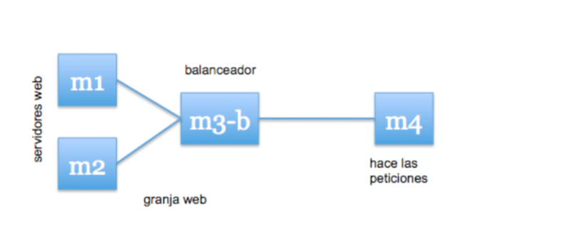

Como apreciamos en la imagen, necesitamos una tercera máquina, en la cual vamos a instalar el software de balanceo. 
Nuestro primer paso será pues añadir nuestra máquina a nuestra estructura. Una vez añadida nuestro siguiente paso será configurar Nginx como balanceador.

------
## NGINX

Nginx es un servidor web ligero de alto rendimiento. Debido a su buen rendimiento se suele usar como servidor web en lugar de Apache, aunque su uso más extendido es como balanceador de carga en un cluster web.
Nosotros nos vamos a centrar en la faceta de balanceador.

### Instalación

En este apartado vamos a ofrecer las ordenes por terminal necesarias para instalar Nginx en ubuntu16 server. Si el lector quiere un tutorial más detallado puede dirigirse a [este enlace](https://www.liberiangeek.net/2016/07/how-to-install-nginx-webserver-on-ubuntu-16-04/
). 

Para hacer la instalación se recomienda seguir las siguientes órdenes:

    sudo apt-get update
    sudo apt-get dist-upgrade
    sudo apt-get autoremove

    sudo apt-get install nginx
    sudo systemctl start nginx

### Configuración 

Como se ha mencionado previamente, Nginx no viene configurado por defecto como balanceador de carga sino como servidor web. Para que cumpla su función como balanceador de carga debemos modificar el archivo 
*/etc/nginx/conf.d/default.conf*
Debemos eliminar el contenido que este archivo tuviese antes, para crear la configuración que nosotros deseemos. En el caso de que este archivo no exista debememos crearlo y modificarlo. 
Vamos a modificar dicho archivo dividiendo el contenido en dos partes:
*  **Upstream**: En esta sección vamos a definir las máquinas que forman parte de nuestra granja web. Para ello debemos escribir las direcciones IP correspondientes. En este apartado podemos modificar el "peso de cada máquina añadiendole "weight" y el valor que queramos. Con ello logramos que el reparto de la carga se adapte a nuestras necesidades y a la potencia de cada máquina. 
*  **Server**: En esta sección vamos a decirle a Nginx que las máquinas previamente definidas son nuestra granja web y debemos repartir la carga entre ellas. Tambien damos información como el puerto de escucha, archivo de logs, nombre del servidor, etc.

El fichero de configuración tras su modificacion o creación debe quedar de la siguiente forma:

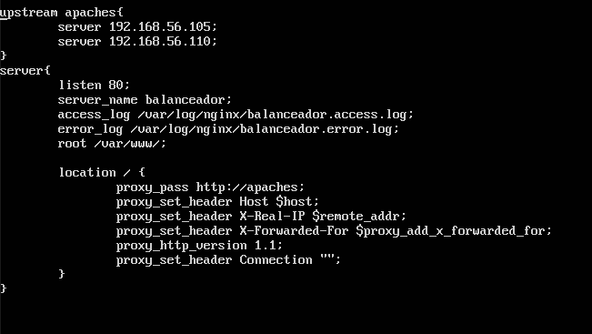

Antes de reiniciar nuestro servicio y cargar los cambios realizados en nuestra configuración, para curarnos en salud de posibles errores, vamos a comentar la linea : 
*include /etc/nginx/sites-enabled/*
Esta linea se encuentra hacia el final del archivo de configuración en 
*/etc/nginx/nginx.conf*
Con esto nos aseguramos que se cargue la configuración que nosotros acabamos de realizar y no la que trae por defecto para ser servidor web.

Llegados a este punto todo lo que nos queda es reiniciar nuestro servicio y probar que todo funciona correctamente.

    sudo systemctl restart nginx

### Prueba

Para comprobar que todo funciona perfectamente se han creado dos html básicos con diferente contenido y mismo nombre en nuestras dos máquinas servidoras:

#### Round-Robin
Ambas máquinas tienen el mismo peso y un algoritmo de reparto por turnos Round-Robin, por lo que el reparto se deberá hacer 50% entre ambas si todo funciona perfectamente. Para comprobarlo, desde nuestra máquina host hacemos peticiones curl con la dirección IP de nuestra balanceadora. 

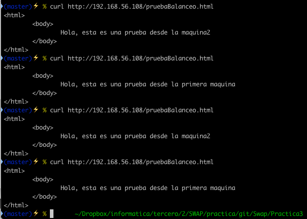

Se observa que el reparto es como se habia predicho y que ambas máquinas reciben las mismas peticiones.

#### Ponderado

Vamos a suponer que una de las máquinas es el doble de potente que la otra, para equilibrar entonces el reparto de carga vamos a configurar el archivo de configuración *default.conf* añadiendole el peso deseado.
El resultado debe quedar así:

    upstream apaches{
        server 192.168.56.105 weight=2;
        server 192.168.56.110 weight=1;
    }

Debemos reiniciar el servicio y probamos

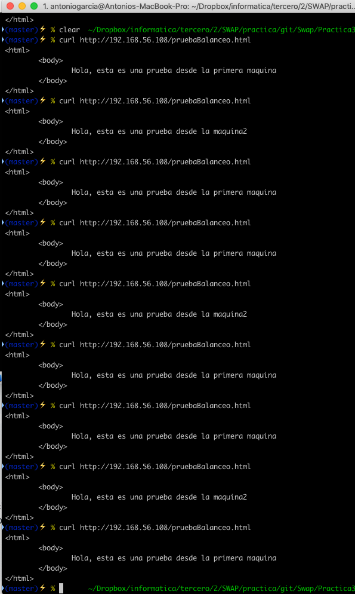

Observamos como ahora ya no se reparten equitativamente la carga, sino que la primera máquina recibe 6 peticiones mientras que la segunda máquina 3. Lo que indica un reparto acorde al peso que le hemos indicado.

#### Alta carga

Para ajustar a la realidad de los servidores, los cuales reciben cientos de miles de visitas, vamos a realizar tests que estresen nuestro balanceador de una manera que se aproxime a la realidad. Para ello vamos a instalar Apache Benchmark (ab) en nuestra máquina anfitriona, de esta forma evitamos que los resultados puedan ser engañosos, ya que se usarían recursos para ejecutar el benchmark.
Para su instalación basta con escribir el siguiente comando en la terminal:

    sudo apt-get install apache2-utils

A continuación vamos a ejecutar la siguiente orden:

    ab -n 10000 -c 10 http://192.168.56.108:80/prueba.html

Aquí se muestra una imagen del estado de las máquinas servidoras mientras se ejecuta el test.

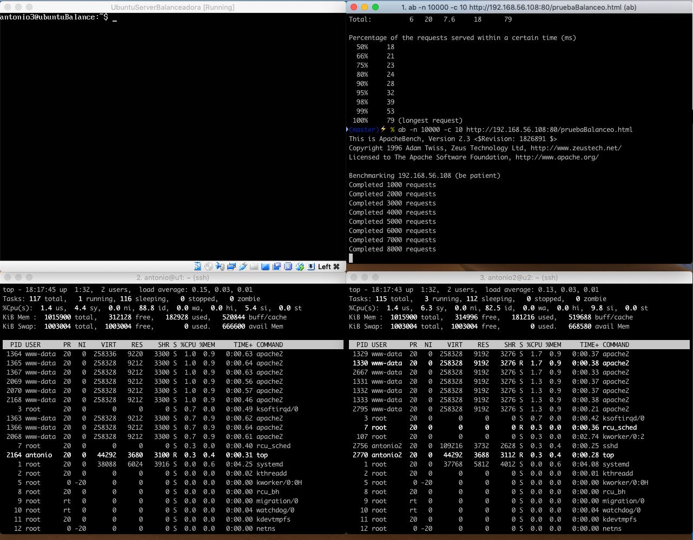

Los resultados despues de ejecutar 10000 peticiones y una concurrencia de 10 son los siguientes:

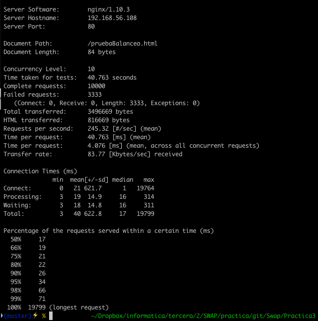

Estos resultados serán comparados con otro balanceador, haproxy, y se compararán para poder saber que balanceador actua con un mejor rendimiento. 
Llegados a este punto debemos parar nuestro balanceador para evitar posibles conflictos con el siguiente software a instalar. Para ello

      sudo systemctl stop nginx

------
## HAPROXY

Haproxy es un software open-source que provee un balanceador de carga de gran confianza y un servidor proxy para aplicaciones basadas en TCP y HTTP que hacen peticiones en multiples servidores, de esta forma puede balancear cualquier tipo de tráfico.
En esta práctica vamos a utilizarlo para balancear peticiones de balanceo sencillas.

### Instalación

Para instalarlo, como siempre, nos vamos a la linea de comandos e introducimos el siguiente comando:

    sudo apt-get install haproxy

### Configuración

En esta ocasión el archivo a modificar lo encontramos en 
*/etc/haproxy/haproxy.cfg*
Debemos dejar la configuración final como sigue:

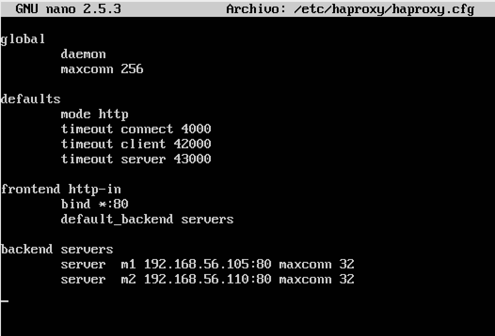

Vemos que nuestro balanceador espera conexiones entrantes por el puerto 80 para redirigirlas a las dos máquinas servidoras m1 y m2 (en las que tenemos los Apache instalados y escuchando en el puerto 80).

### Prueba

Para probarlo debemos lanzar la siguiente orden en la que indicamos el archivo donde debe cargar la configuración asignada:

    sudo /usr/sbin/haproxy -f /etc/haproxy/haproxy.cfg

Si nos sale ningún error, cosa que es bastante probable, ya podemos comenzar a realizar peticiones a la IP del balanceador desde nuestro host. Ahora mismo tenemos el mismo peso asignada a ambas máquinas, por lo que deberán repartirse por igual la carga.

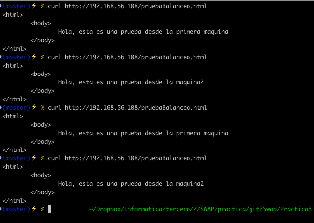

Observamos que las reparte por igual una a una, lo que indica que el balanceador esta funcionando perfectamente.

#### Ponderado

Al igual que en nginx, tenemos que modificar el archivo de configuración de haproxy dandole más peso a una que otra, vamos a volver a asignar el doble de peso a la primera que a la segunda. Para ello modificamos la parte final del archivo de configuración, dejando las ultimas lineas así:

     backend servers
        server m1 192.168.56.105:80 maxconn 32 weight 2
        server m2 192.168.56.110:80 maxconn 32 weight 1

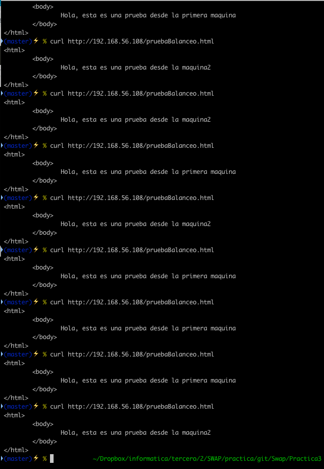

Observamos como de nuevo, la distribución de la carga es diferente y la maquina 1 recibe una cantidad igual al doble que la segunda.

#### Alta carga

Al igual que hicimos con Nginx, vamos a someter al balanceador a una carga que se pueda aproxmiar al tráfico que puede llegar a tener un sitio web normal. Para ello ejecutamos la misma orden con ab:
    
        ab -n 10000 -c 10 http://192.168.56.108:80/prueba.html

Los resultados son los que se muestran en la imagen siguiente

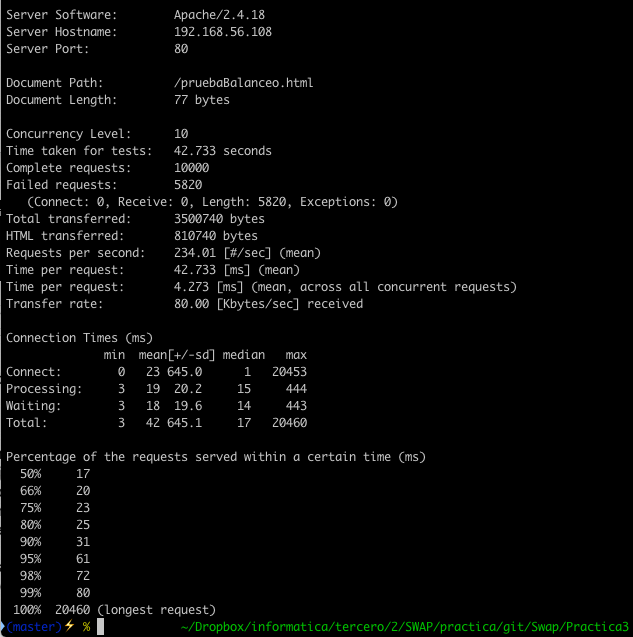

---

#### Comparativa final de Resultados

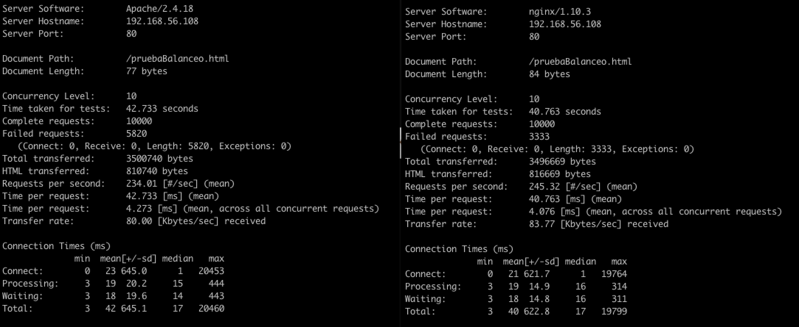

Como pordemos observar, la media por petición de Nginx es ligeramente mejor que la de Haproxy.
Nginx ->4.076ms
haprx ->4.273ms
  