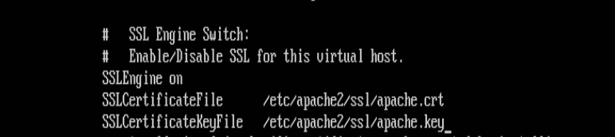
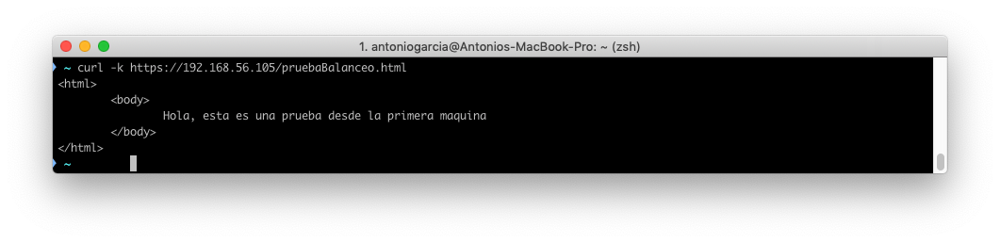
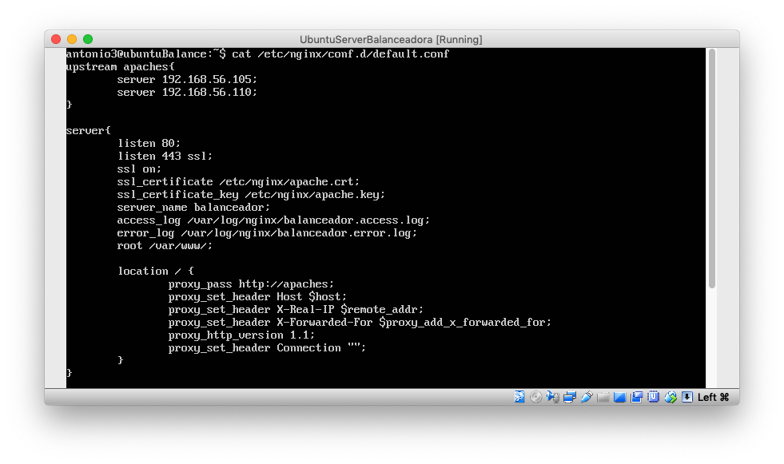
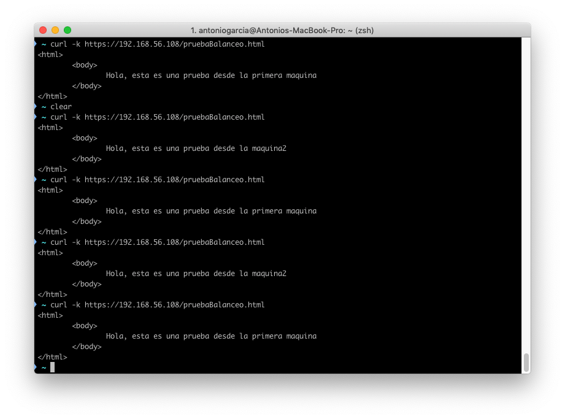

# Práctica 4. Asegurar la granja web
------

## Objetivos de la práctica:

En esta práctica vamos a configurar nuestras máquinas para ofrecer una seguridad en nuestra granja web, para ellos instalaremos un certificado SSL para configurar el acceso HTTPS a los servidores y configuraremos las reglas del cortafuegos para proteger la granja web.

## Instalación del certificado SSL autofirmado para configurar el acceso por HTTPS
----

Los pasos que debemos realizar para generar nuestro certificado serán los siguientes. 
En primer lugar debemos activar el módulo ssl de Apache.

    sudo a2enmod ssl

A continuación crearemos el directorio en el que vamos a guardar nuestros certificados y le especificaremos la ruta a los certificados en la configuración.

    mkdir /etc/apache2/ssl
    openssl req -x509 -nodes -days 365 -newkey rsa:2048 -keyout
    /etc/apache2/ssl/apache.key -out /etc/apache2/ssl/apache.crt

Nos pedirá una serie de datos que debemos rellenar los cuales sirven para configurar el dominio.

A continuación deberemos editar el archivo de configuración del sitio default-ssl:

    nano /etc/apache2/sites-available/default-ssl.conf

Debemos agregar las siguientes lineas debajo de donde pone SSLEngine on.

    SSLCertificateFile /etc/apache2/ssl/apache.crt
    SSLCertificateKeyFile /etc/apache2/ssl/apache.key

Debe quedar como se muestra en la imagen.

Ahora debemos activar el sitio y reiniciar apache:

    a2ensite default-ssl
    service apache2 reload

Ahora ya podemos hacer peticiones HTTPS utilizando la herramienta curl. Para ello nos vamos a nuestro host y ejecutamos 
    
    curl -k https://ipmaquina/index.html

A continuación se muestra un ejemplo de su funcionamiento.

## Instalación del certificado SSL en nuestra granja web
----

Ahora debemos configurar el balanceador y las máquinas que tengamos en la granja web para que acepten peticiones HTTPS. 
Para ello tenemos que copiar los certificados en todas las máquinas que tengamos en nuestra granja además de configurarlas como hicimos con la primera, a excepción de crear los certificados, ya que estos los copiaremos en todas ellas.
Los pasos a repetir entonces serían:

-Habilitar el módulo ssl
-Crear el directorio
-Configurar el archivo de configuración default-ssl
-Reiniciar el servicio.

### Copiar certificados en las máquinas.

Para copiar los certificados en nuestras máquinas nos iremos a la carpeta contenedora de nuestros archivos y ejecutaremos el siguiente comando scp.

    scp apache.crt antonio2@192.168.56.110:/home/antonio2
    scp apache.key antonio2@192.168.56.110:/home/antonio2
    

A continuación moveremos nuestros dos archivos a nuestra directorio creado anteriormente.

### Configuración de nuestro balanceador de carga

Para configurar nuestro balanceador de carga y que acepte tanto peticiones HTTP como HTTPS deberemos editar nuestro archivo de configuración NGINX para que acepte tráfico tanto por le puerto 80 como por el 443.
La configuración final quedaría como se muestra en la imagen.

Ahora debemos reiniciar el sistema para que los cambios tengan en efecto y probamos a hacer consultas desde nuestra máquina principal.
El resultado se muestra en la siguiente imagen.

Vemos que efectivamente, las consultas HTTPS funcionan perfectamente, luego nuestro balanceador esta funcionando correctamente.

## Configuración del cortafuegos
----

Iptables es una herramienta de cortafuegos, de espacio de usuario, con la que el superusuario define reglas de filtrado de paquetes, de traducción de direcciones de red,y mantiene registros de log.
Nosotros deberemos configurar el cortafuegos de una de las máquinas, para ello se ha creado el siguiente script con las opciones necesarias para habilitar accesos al puerto 80 y al puerto 443.

    #!/bin/bash

    # (1) Eliminar todas las reglas (configuración limpia)
    iptables -F
    iptables -X
    iptables -Z
    iptables -t nat -F

    # (2) Política por defecto: denegar todo el tráfico
    iptables -P INPUT DROP
    iptables -P OUTPUT DROP
    iptables -P FORWARD DROP
    
    # (3) Permitir cualquier acceso desde localhost (interface lo)
    iptables -A INPUT -i lo -j ACCEPT
    iptables -A OUTPUT -o lo -j ACCEPT 

    # (4) Abrir el puerto 22 para permitir el acceso por SSH
    iptables -A INPUT -p tcp --dport 22 -j ACCEPT
    iptables -A OUTPUT -p tcp --sport 22 -j ACCEPT

    # (5) Abrir los puertos HTTP (80) de servidor web
    iptables -A INPUT -p tcp --dport 80 -j ACCEPT
    iptables -A OUTPUT -p tcp --sport 80 -j ACCEPT

    # (6) Abrir el puerto HTTPS (443) de servidor web
    iptables -A INPUT -p tcp --dport 443 -j ACCEPT
    iptables -A OUTPUT -p tcp --sport 443 -j ACCEPT

    