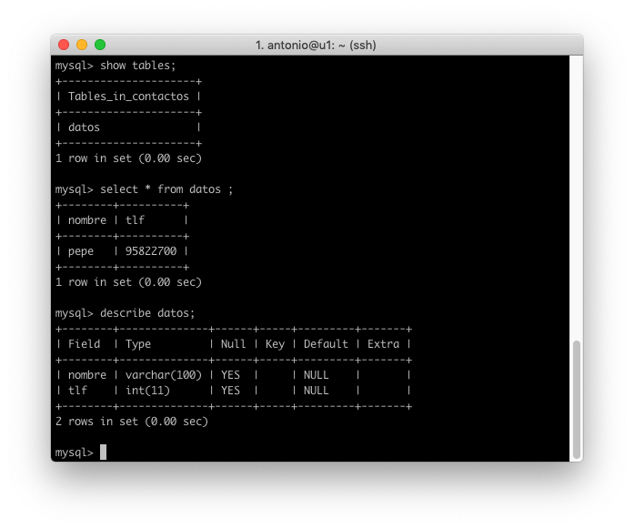
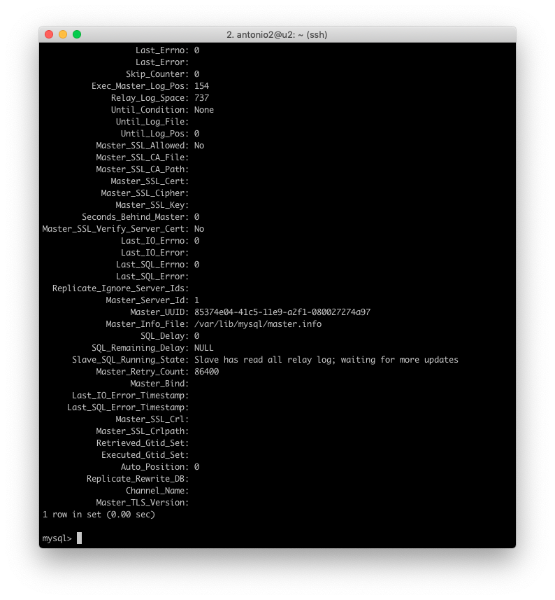
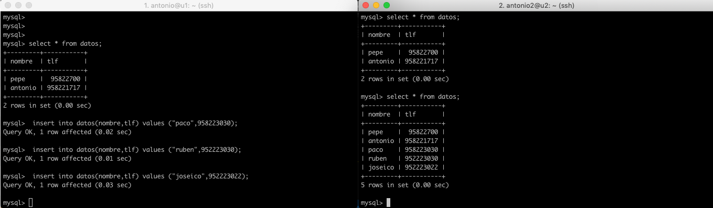

# Práctica 3. Clonar la información de un sitio web
------
## Objetivos de la práctica:

- Copiar archivos de copia de seguridad mediante ssh.
- Clonar manualmente BD entre máquinas.
- Configurar la estructura maestro-esclavo entre dos máquinas para realizar elclonado automático de la información.
------

### Creación de la base de datos

Vamos a comenzar creando una base de datos sencilla en la que insertaremos una tupla. Este paso es obviamente opcional si ya tenemos una base de datos creada y queremos interactuar directamente con ella. 
Para la creación de la base de datos se han utilizado los siguientes comandos.
     
    mysql -uroot -p

    mysql> create database contactos;
    mysql> use contactos;
    mysql> create table datos(nombre varchar(100),tlf int);
    mysql> insert into datos(nombre,tlf) values ("pepe",958227700);

Con estas sentencias ya tenemos creada nuestra tabla con una tupla insertada. 

### Replicar una BD MySQL con mysqldump

MySQL ofrece la una herramienta para clonar las BD que tenemos en nuestra maquina. Esta herramienta es mysqldump.
El volcado que realiza mysqldump contiene comandos SQL para crear la BD, sus tablas y rellenarlas.
Si queremos saber todos los comandos que podemos realizar con mysql bastaría ejecutar:

    mysqldump --help

Continuando con la base de datos creada, nosotros vamos a proceder a volcarla en un fichero el cual exportaremos después. El comando que vamos a utilizar para volcar nuestra base de datos es el siguiente:

    mysqldump contactos -u root -p > BDContactos.sql

Esto puede ser suficiente, pero tenemos que tener en cuenta que los datos pueden estar actualizándose constantemente en el servidor de BD principal. En este caso, antes de hacer la copia de seguridad en el archivo .SQL debemos evitar que se acceda a la BD para cambiar nada.
Para ello, antes de lanzar el comando anterior, conviene "bloquear" las tablas.

    mysql -u root –p
    mysql> FLUSH TABLES WITH READ LOCK;
    mysql> quit

Y ahora si lanzariamos nuestro comando mysqldump.
Ahora disponemos de nuestro archivo BDContactos.sql en nuestra primera máquina, para poder continuar debemos "desbloquear" las tablas.

    mysql -u root –p
    mysql> UNLOCK TABLES;
    mysql> quit

### Transferir copia y configuración

Una vez tenemos nuestro archivo, debemos ir a nuestra segunda máquina y ejecutar el comando scp correspondiente. En nuestro caso sería:

    scp antonio@192.168.56.105:/home/antonio/BDContactos.sql /tmp

Es importante destacar que el archivo .SQL de copia de seguridad tiene formato de texto plano, e incluye las sentencias SQL para restaurar los datos contenidos en la BD en otra máquina. Sin embargo, la orden mysqldump no incluye en ese archivo la sentencia para crear la BD (es necesario que nosotros la creemos en la máquina secundaria en un primer paso, antes de restaurar las tablas de esa BD y los datos contenidos en éstas).
Por tanto, procedemos a crear la base de datos en la segunda máquina:

    mysql -u root –p
    mysql> CREATE DATABASE contactos; 
    mysql> quit

Ahora para restaurar la base de datos:

     mysql -u root -p contactos < /tmp/BDContactos.sql

Y ya disponemos en nuestra segunda máquina de una copia exacta de la BD.

## Replicación de BD mediante una configuración maestro-esclavo

### Configurar archivos
La opción anterior aunque funciona bien, no es escalable. Sin embargo, MySQL tiene la opción de configurar el demonio para hacer replicación de las BD sobre un esclavo a partir de los datos que almacena el maestro.

Se trata de un proceso muy adecuado para un entorno de producción real.
Debemos hacer algunas configuraciones en ambas máquinas.

Vamos a empezar configurando nuestra máquina maestra. Para ello debemos configurar en modo root el archivo /etc/mysql/mysql.conf.d/mysqld.cnf

Los cambios a realizar son:

- Comentar la linea #bind-address 127.0.0.1
- log_error = /var/log/mysql/error.log
- server-id = 1
- log_bin = /var/log/mysql/bin.log
  
Una vez hayamos realizado los cambios debemos reiniciar mysql, para ello:

    sudo /etc/init.d/mysql restart

Ahora deberemos hacer los pertinentes cambios en nuestra máquina esclava, para ello modificamos el mismo archivo en la otra máquina, pero esta vez
- server-id = 2

Reiniciamos tambien el servicio en nuestra máquina esclava.

### Configurar base de datos

Ahora necesitamos introducir los siguientes comandos en nuestra máquina maestra. Entramos en mysql:

    mysql> CREATE USER esclavo IDENTIFIED BY 'esclavo';
    Query OK, 0 rows affected (0.01 sec)

    mysql> GRANT REPLICATION SLAVE ON *.* TO 'esclavo'@'%' IDENTIFIED BY 'esclavo';
    Query OK, 0 rows affected, 1 warning (0.01 sec)

    mysql> FLUSH PRIVILEGES;
    Query OK, 0 rows affected (0.01 sec)

    mysql> FLUSH TABLES;
    Query OK, 0 rows affected (0.02 sec)

    mysql> FLUSH TABLES WITH READ LOCK;
    Query OK, 0 rows affected (0.00 sec)

    mysql> SHOW MASTER STATUS;
    +------------------+----------+--------------+------------------+-------------------+
    | File             | Position | Binlog_Do_DB | Binlog_Ignore_DB | Executed_Gtid_Set |
    +------------------+----------+--------------+------------------+-------------------+
    | mysql-bin.000001 |      980 |              |                  |                   |
    +------------------+----------+--------------+------------------+-------------------+
    1 row in set (0.00 sec)

    mysql>

   
    mysql> CHANGE MASTER TO MASTER_HOST='192.168.56.105', 
    MASTER_USER='esclavo', MASTER_PASSWORD='esclavo',MASTER_LOG_FILE='mysql-bin.000001', 
    MASTER_LOG_POS=980, MASTER_PORT=3306;

Volvemos a la máquina esclava y tenemos que introducir las siguientes sentencias:

    mysql> CHANGE MASTER TO MASTER_HOST='192.168.31.200', 
    MASTER_USER='esclavo', 
    MASTER_PASSWORD='esclavo', 
    MASTER_LOG_FILE='mysql-bin.000001', 
    MASTER_LOG_POS=501, MASTER_PORT=3306;

Ya esta todo listo para que las dos máquinas se comuniquen. Para ello comenzamos el servicio con:

    mysql> START SLAVE;

Volvemos ahora al maestro y activamos las tablas para que puedan actualizarse.

    mysql> UNLOCK TABLES;

Para asegurarnos de que todo funciona bien y que maestro y esclavo esta comunicados, en el esclavo escribimos la siguiente orden:

    mysql> SHOW SLAVE STATUS\G

El valor que nos dice si todo va bien sera el de la variable "seconds_behind_master"
Este valor tiene que ser diferente de null. Si es así, significa que todo funciona bien.

### Comprobación

Para comprobar que las bases de datos se sincronizan perfectamente, nos vamos a nuestra máquina principal e introducimos algunos datos a nuestra tabla. Como podemos observar en la imagen, estas estan perfectamente sincronizadas.

